# <span style= "color:#46a3ff"><font size="7">显示屏SPI接口入门</font></span>


# <span style= "color:#009100"><font size="6">前言</font>

<font size="5"> **<span style= "color:red"> 本文档未经作者许可严禁转载。** </font>

>本文档将初步介绍单片机开发中常用的SPI总线，并以128*64分辨率的0.96"OLED显示屏(驱动IC为SSD1306)为例，简单介绍如何在单片机上使用SPI总线实现对配有显示屏控制器的小尺寸显示屏控制。适合已对单片机有所了解并具备一定的单片机编程能力的读者学习小尺寸显示屏上使用的SPI接口。


# <span style= "color:#009100"><font size="6">SPI接口介绍</font>

### 什么是SPI？

SPI（Serial Peripheral Interface，即串行外设接口）总线是最早由Motorola公司推出的一种同步串行接口技术。SPI总线系统是一种同步串行外接口，允许MCU与各种外围设备以串行方式进行通信，数据交换。
通常情况下，SPI总线具有通信速率灵活可控、时序相对简单、信号线需求较少的特点。在MCU不具备硬件SPI能力时也能够方便地通过软件的方式使用GPIO进行模拟。常用的使用SPI接口的器件包括但不限于W25Qxx系列FLASH芯片以及多数小尺寸显示屏的驱动IC。

### SPI总线构成

SPI典型的全双工模式应用包含4条线：时钟信号线SCLK、“主发从收”数据线MOSI、“主收从发”数据线MISO、片选线NSS。以下是4条信号线的具体说明：
* SCLK：时钟信号线，由主设备产生并发出，用于控制数据传输的速率。
* MOSI(Master out slave in)：主设备数据输出/从设备数据输入引脚。该引脚在主模式下发送数据，在从模式下接收数据。
* MISO(Master in slave out)：主设备数据输入/从设备数据输出引脚。该引脚在从模式下发送数据，在主模式下接收数据。
* NSS：片选信号线，由主设备发出，用于控制从设备间的通信。


>实际使用中的信号线数量取决于具体的通讯方式和设备数量。例如显示屏控制器常用的4-line SPI interface虽然也使用4条信号线，但却是单工通信，这个后文会讲到。另外，SPI还有Dual-SPI和Quad-SPI这两种拓展接口。

>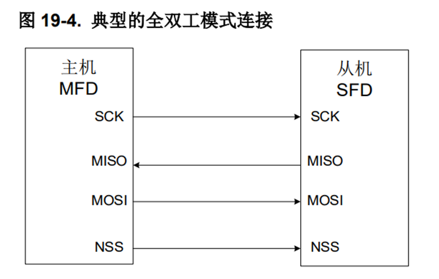
>>典型的SPI全双工模式接线图，图片来自GD32F30x用户手册。

SPI也支持多设备通信。在需要实现单主多从的通信时，多个从设备间可以共用数据线和时钟线，只需从主机引出不同的片选线至从设备的片选引脚，**分时将片选拉低**即可选中需要进行通信的从设备。

### SPI与其他常见通信方式对比


|      |最大通信速率|信号线数量|各信号线名称|是否可软件模拟|
|:----:|:----:|:----:|:----:|:----:|
|SPI|取决于实际通信设备|4|SCLK、MOSI、MISO、NSS|是|
|IIC|取决于实际通信设备：100kbit/s(标准模式)、400kbit/s(快速模式)、3.4Mbit/s(高速模式)|2|SCL、SDA|是|
|UART|取决于实际通信设备：9600bps-115200bps(常用)|2|RXD、TXD|否|
|8080-8bits|取决于实际通信设备|12|D/C#、CSB、WR#、RD#、D[7:0]|是|

上表选取了几种常用通信方式进行对比。通过对比可以发现，SPI相比IIC和UART仅增加两条信号线，对单片机IO的占用依然较少，而且也可以通过软件操作单片机IO得方式模拟实现。传输速率方面，SPI的最大通信速率一般都显著大于IIC的快速模式，具体速率取决与通信双方。
>实际上，通过对代码执行时间的精确计算，软件操作IO口模拟实现UART也是可以实现的。但由于软件模拟UART困难且其稳定性和效率一般很低，故表中标注UART不支持软件模拟。

### 硬件SPI
硬件SPI是指通过主控MCU集成的SPI控制器硬件上自动生成SPI时序。相比软件操作GPIO模拟SPI的方式，使用硬件SPI可以显著提高数据传输速度，同时可以通过调整时钟分频使SPI的传输速度更加精准可控。另外，硬件SPI配合DMA功能还能实现非阻塞式数据传输，将CPU从控制生成SPI时序这一“体力活”中解放出来。现在大部分的单片机也都会支持硬件SPI的功能。
>传统8051单片机这种远古产品当然是没有这些功能的，但比较新一点的增强型8位8051或者32位8051可能支持。而stm32即使是入门型号的stm32f103c8t6也具备硬件SPI+DMA的功能。想知道自己手上的单片机有什么功能请自行查阅相关数据手册。
>>查阅数据手册可知，GD32F303ZKT6具有3个SPI控制器且均支持DMA功能。

在需要较高传输速率或需要传输速率精确可控的场景下，使用硬件SPI是更好的选择，因为往往可以通过合理配置时钟来满足要求。特别是主控MCU在使用SPI协议向显示屏控制器发送大量显示数据时，SPI+DMA+双缓冲的方案通常可以实现比较理想的显示效果。
>以320*240分辨率的TFT彩屏为例,在使用RGB565格式时，整屏画面共有1228800位数据。即使以20Mbit/s的速率不间断地发送数据（实际在使用软件模拟的方案时，大多数单片机都远达不到这个发送速率），刷新整屏画面也需要超过61ms的时间，此时帧率约为16FPS。可想而知，如果不使用DMA方案实现非阻塞式发送，CPU都没有时间去处理其他任务了。

# <span style= "color:#009100"><font size="6">从零开始点亮一块OLED</font>

本章节将以0.96"OLED及其驱动芯片SSD1306为例，介绍如何从零开始点亮一块显示屏。
>虽然笔者在本文档中以网络上教程中常见的SSD1306作为例子讲解如何从头开始写屏幕的SPI驱动，但不同型号单色屏驱动IC的驱动程序实际上相似度很高，相信读者在读完本文档后也能轻松地搞定其他屏幕驱动IC。

>### 屏幕介绍
>先简短地说明一下屏幕。现在大多数单片机教程视频中使用的显示屏都是128*64分辨率的0.96"OLED，驱动IC为SSD1306。教程中一般都会使用厂商制作好的屏幕模块，就不需要考虑裸屏的引脚定义、驱动电路之类的问题，用杜邦线把模块针脚和单片机IO连接一下就行，顶多再加两颗上拉电阻。这款屏幕的常见模块有两种：1种仅有4个针脚，这种就只支持IIC接口；另一种有7个针脚，通过自行改变模块背面的电阻连接可以选择使用IIC接口还是SPI接口（一般默认SPI接口）。
>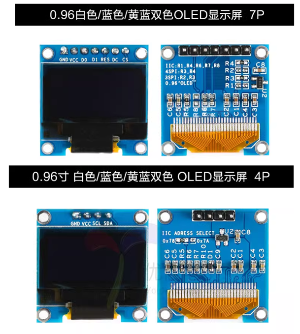
>>两种0.96"OLED模块的实物图，**注意只有上面的7P模块才支持SPI接口**。
>
>然后其实也可以使用裸屏。**但如果只是日常学习而不需要制作产品级的实物，不推荐使用裸屏。** 因为需要自行找厂家要到屏幕的尺寸图纸、引脚定义、规格书之类的资料，然后自行设计相关电路并焊接元件，比较麻烦。
>
>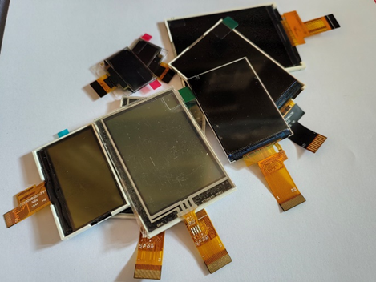
>>一些显示屏模组（裸屏）

## 点屏第一步：看手册

想要使用SPI接口与OLED显示屏或其他小尺寸显示屏通信，首先需要找到对应型号显示屏驱动芯片的数据手册。在数据手册中查看该驱动芯片是否支持SPI Interface。如果支持，则还需要查找如何配置驱动芯片的通信方式为4-wire SPI Interface或3-wire SPI Interface。接下来以4-wire SPI Interface为例。

* 首先需要**查明显示屏使用的驱动IC型号**。从厂家的说明中可以了解到，我们使用的0.96"OLED屏幕的驱动芯片为SSD1306。
* 随后查阅SSD1306的数据手册，看**SSD1306是否支持SPI Interface**。经过阅读手册可知，SSD1306支持4-wire SPI Interface和3-wire SPI Interface。

>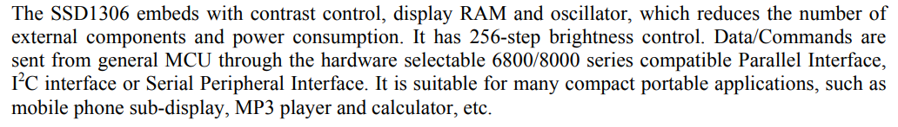
>>截图来自SSD1306的数据手册
* 查看手册应如何配置接口为4-wire SPI Interface。发现SSD1306的接口是通过BS[2:0]这三个引脚的状态决定的，且**BS[2:0]的状态均为0时接口配置为4-wire SPI Interface**。对于使用模块的读者，请根据自己模块的说明进行配置。对于使用裸屏的读者，请根据裸屏的引脚定义进行配置。
>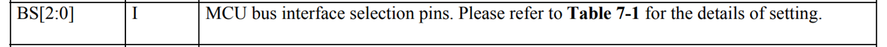
>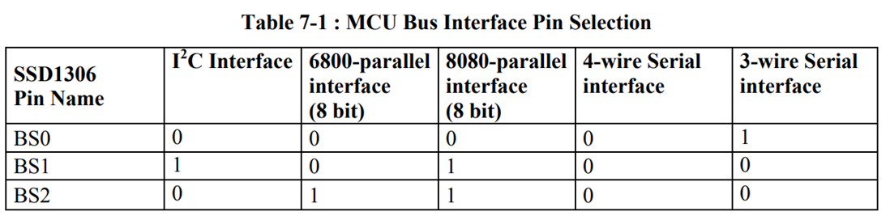
>>BS[2:0]的引脚说明及接口配置方法，截图来自SSD1306的数据手册。
>有些驱动芯片的手册中可能会将用于接口选择的引脚称为IM,在阅读其他驱动芯片的手册时如果找不到BS也可以试试查找IM。

## 点屏第二步：看时序
想要使用SPI协议进行通信，准确无误的时序至关重要。驱动IC的数据手册中一般都会给出所需的时序图。我们可以通过观察时序图和阅读相关说明了解正确的时序。笔者提前截取了手册中的部分内容放在下面供读者参考（读者也可以自行阅读数据手册）。

>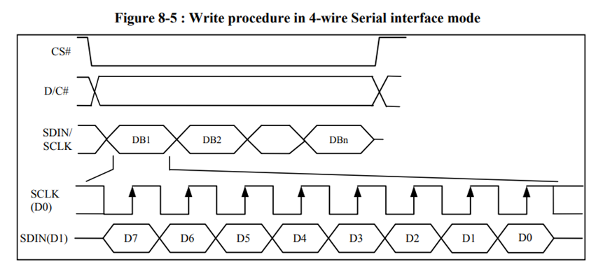
>>SSD1306 Datasheet给出的4-wire SPI Interface时序图

>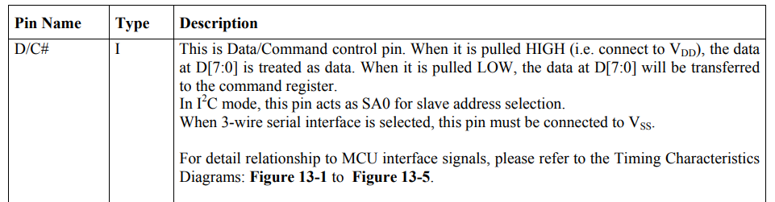
>>SSD1306 Datasheet对D/C#的描述

> *SDIN is shifted into an 8-bit shift register on every rising edge of SCLK in the order of D7, D6, ... D0. D/C# 
is sampled on every eighth clock and the data byte in the shift register is written to the Graphic Display Data RAM (GDDRAM) or command register in the same clock.*
> *Under serial mode, only write operations are allowed.*
>>SSD1306 Datasheetd对4-wire SPI Interface mode的描述

分析时序图可以发现，相比之前提到的典型SPI连接，4-wire SPI Interface**只有一条数据线SDIN（但多了D/C#）**。结合时序图和手册说明，可以知道**SSD1306的SPI接口是单工的**，只支持主控MCU向驱动IC发送数据而不支持读取。而额外增加的D/C#线则用于指示发送的数据是指令还是显示数据。
另外，我们还需要注意触发数据锁存的时机，正确的触发时机保证了锁存数据的正确性。比较常见的触发方式有四种：上升沿触发、下降沿触发、低电平触发、高电平触发。而此处的SPI协议使用的是**上升沿触发**：即在时钟信号出现上升沿时，驱动IC将信号线上的数据锁存。

>在SSD1306的数据手册中，数据/指令选择的数据线被称为"D/C#"，而在有的手册中则被称为"A0"（由于笔者的习惯，本文档的剩余部分将统一称之为A0）。该线传输的数据为0时表示发送的是指令，为1表示发送的是显示数据。另外SSD1306数据手册的时序图其实给得不是很好，没有给出A0的正确时序，而仅仅是文字上说明了一下。实际上，A0的数据在4-line SPI Interface下是在时钟的第8个上升沿与D0一起锁存的。
>>搞清楚上面的时序要求后，实际上就已经可以开始尝试编写主控MCU的代码向驱动IC发数据了，但笔者也推荐先去查看一下数据手册中的AC Characteristic部分，更细致地了解一下时序要求。
>>另外有兴趣的读者也可以顺便阅读一下手册中对3-wire SPI的描述。三线模式就没有单独的一条信号线给A0了，此时原本的A0将作为第一位数据被首先发送。

## 点屏第三步：实现SPI数据传输
>由于不同的芯片配置硬件SPI的具体方法不一样，故本文档不介绍如何配置硬件SPI，只介绍如何通过软件操作GPIO的方式模拟实现SPI传输数据。想要使用自己芯片上的硬件SPI或者DMA功能的读者可以参考自己主控芯片的用户手册进行配置，或者直接调用适用于自己主控芯片的库函数。

上面我们已经弄清了SPI时序要求，下面来实现具体的SPI数据传输。笔者在这里重新放一张ST7567的时序图方便参考。
>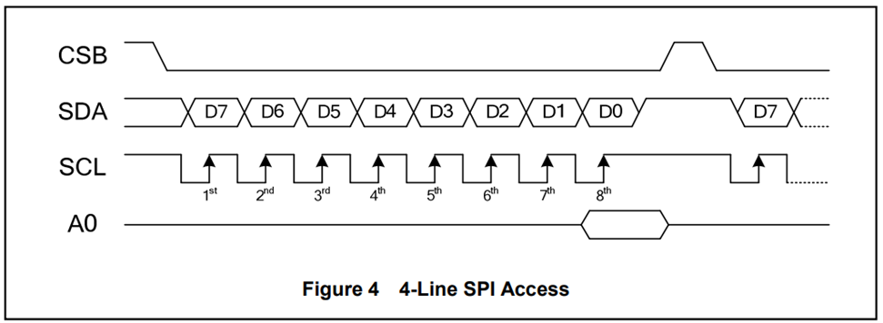
>>ST7567 DataSheet中提供的的4-line SPI时序图

* 首先，需要**将片选信号CS拉低**（即将连接了CS引脚的单片机IO口置0）。片选信号置0后表明显示屏驱动IC被选中，可以进行数据发送。
* 由于数据在时钟的上升沿触发锁存，故可以先将SCL信号置0，这样一来只需在合适的时机将其置1即可产生上升沿。
* 随后，由于此处的SPI协议是高位在前，故应从**最高位开始逐位取出单字节数据中的各数据位**，并将SDA对应的IO状态设置为该数据位。
* 将SCL置高以**产生上升沿，触发锁存**。
* 重复上述操作直至发送结束。注意需要在**每个字节的最低位发送时同步设置A0**以指明当前字节是数据还是指令（也可在每个字节发送开始时就设置好A0的状态，看个人编程习惯）。
* 数据发送结束后需要**将片选信号置高**，以避免误操作。

>发送指令和发送数据的C语言参考代码如下所示，该代码是笔者最早在STC89C516RD+单片机上使用的。如果需要移植到其他单片机上，只需要将代码中对cs1、rs、sclk2、sda2的操作换成其他单片机对相应IO口的操作即可。
```
sbit 	cs1 = P3^0;
sbit    rs = P3^2;
sbit	sclk2 =P1^6;
sbit	sda2 =P1^7;
// 写命令子程序*********************************************************
void write_command(uchar command)
{
    uchar x;
    rs=0;   //rs = P3^2;     //RS=0,拉低A0,表示数据为指令
    cs1=0;  //cs1 = P3^0;    //cs1=0,拉低片选
    for(x=0;x<8;x++)        //循环8次
    {
       	sclk2=0;			//sclk2 =P1^6;
        if((command&0x80)==0x80)
        {
            sda2=1;			
        }
        else
        {
            sda2=0;
        }
        command=command<<1; //左移一位
        sclk2=1;    //SCKL=1		//时钟置高，上升沿锁存数据
    }
    cs1=1;         //cs1=1		//片选置高，数据发送结束
}
// 写数据子程序*********************************************************
void write_data(uchar dis_data)
{
    uchar x;
    rs=1;    //RS=1		//置高A0，表示数据为显示数据
    cs1=0;   //cs1=0
    for(x=0;x<8;x++)    //循环8次
    {
        sclk2=0;	//SCLK2=0
        if ((dis_data&0x80)==0x80) 
        { 
           	sda2=1;
        }
        else
        {
            sda2=0;
        }
        dis_data=dis_data<<1;   //左移一位
        sclk2=1;                //SCKL=1
    }
    cs1=1;                      //cs1=1
}
```

## 点屏第四步：复位及初始化

一般来讲，屏幕模组上电后在开始向其写入显示数据前还需要进行复位和初始化。复位会使芯片的内部寄存器重置为默认值，初始化则对驱动芯片的一部分寄存器进行配置以调整屏幕的显示效果。
虽然SSD1306的数据手册中也给出了推荐的上电操作过程，但是实际使用中我们**一般采用厂家提供的初始化序列**。

>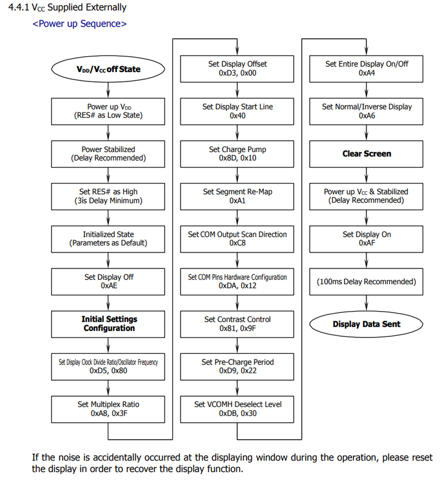
>>截自某公司生产的0.96寸显示屏模组的规格书。

笔者大致总结一下截图所示的整个初始化过程：
1. 显示模组上电后先拉低复位引脚，一段时间后再置高以完成复位过程
2. 按顺序依次向驱动芯片发送各个初始化指令
3. 发送0xAF命令打开屏幕显示
4. 开始发送显示数据

>图中所示的初始化序列其实一般都能找厂家或卖家要到参考代码，往往直接复制过来略加修改即可使用。但有时候给的例程不一定适配于用户手上的主控芯片，或者干脆只有伪代码或者一张图。这时候也只需要自己把这些指令和数据按顺序分离出来，然后逐个用合适的方式发送给驱动芯片即可。初始化过程本质上只是按序发送一些特定的数据给驱动芯片，在要发送的内容和发送方法都已明确时，完成初始化是非常容易的。

>对于初始化序列中各指令的作用，有兴趣的读者可以自行阅读SSD1306的数据手册。上面给出的初始化序列也只是一个厂家推荐的初始化序列，其中可能有些多余的步骤，也有一些指令的发送顺序和内容可以自行修改。

## 点屏第五步：写入显示数据

我们知道，显示屏显示的画面实际上是由一个个像素点所构成。对于单色的OLED，每个像素点只有两种状态，即点亮和熄灭，对应1和0。而我们将要向显示屏驱动芯片发送的数据，就是屏幕上各个像素点的状态。

想要改变屏幕上的显示内容，除了连续发送整块屏幕的数据来进行**全屏刷新**以外，我们也可以通过指定显示数据的写入位置来实现屏幕的**局部刷新**。对于单色屏幕的控制器，我们可以直接实现**精确到page和column的位置指定**。
>SSD1306提供三种Memory addressing mode(Page addressing mode,Horizontal addressing mode,Vertical addressing mode)供用户选择。三种模式的异同和配置方法请自行查阅数据手册。

写入显示数据的一般流程如下：
1. 设置Page地址
2. 设置Column地址
3. 逐字节发送显示数据

注意流程中 **“设置Page地址”和“设置Column地址”均为指令**，故进行这两项操作时A0应为0（即应调用上文中编写的write_command()函数），而发送显示数据时A0应为1（即应调用上文中编写的write_data()函数）。设置Page地址和设置Column地址的方法以及指令内容需要参考数据手册，可以在数据手册的“COMMAND TABLE”和“COMMAND DESCRIPTIONS”中找到具体的说明。

>page相当于纵坐标，column相当于横坐标。但需要注意一个page包含8行，故我们不能直接实现显示数据的像素级定位和修改。如果希望实现像素级的显示数据修改，则需要在主控芯片上提前通过合适的算法对发送数据进行处理。

>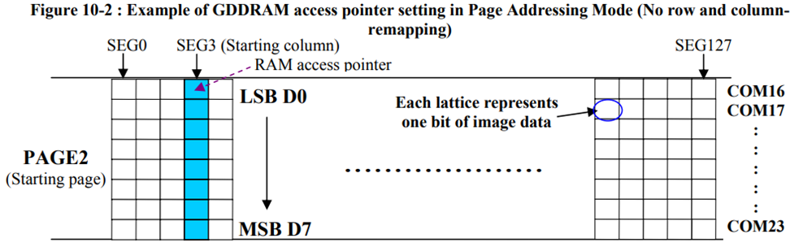
>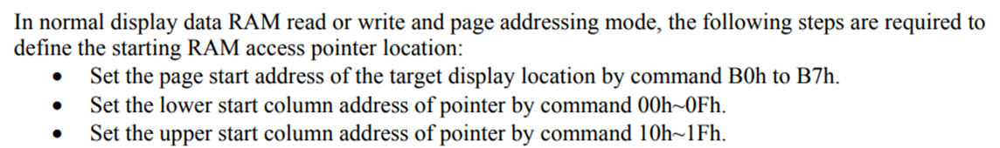
>>SSD1306 DataSheet对显存相关内容的一部分说明，上面的图片展现了显存数据和像素点的对应关系。驱动IC的显存结构和指针移动方式等具体内容请读者自行查阅数据手册。

## 点屏最关键的一步：动手实践！

相信能坚持看到这里的读者应当已经具备独立点亮0.96"OLED显示屏的能力啦！但正所谓实践出真知，请各位读者不要光看不做，务必用自己熟悉的主控MCU尝试点亮自己的OLED显示屏。简单一点的话可以在屏幕上显示一个填充的正方形。想尝试进阶操作的话可以想想要如何才能绘制圆形、三角形等其他基本图形，也可以先实现在显示屏上显示文字或者图片。
>显示文字或者图片的话则需要用到文字或图片的取模软件。

---
# <span style= "color:#009100"><font size="6">一些其他内容</font>

>显示屏的驱动IC和通信协议其实有很多种，笔者将在本章节中随便聊聊几款，顺便写一点关于主控选型的内容。欢迎对显示屏比较熟悉的读者一起交流，也非常希望读到本篇文档的嵌入式大神们能大方地留下宝贵建议。由于本章节中一部分东西其实笔者也没做过（还在继续努力学习），有些内容来自于网上看过的帖子或者主观看法，如果有读者发现错误之处还请指正。

除正文中的使用SSD1306的0.96"OLED，笔者点亮过的显示屏有：1.9寸12048LCD、2.4寸12864LCD、2.0寸320240TFT、2.4寸320240TFT、2.8寸320240TFT，其中使用的显示屏驱动IC包括：ST7567、ST7789V2、GC9307、ST77916。虽然种类比较多，但基本的点屏方法都比较类似，总结起来其实只有单色屏和彩屏两种类型。笔者自信本篇文档的主要章节已经将单色屏的点屏方法讲得比较清楚了，下面略写一点对彩屏的理解。

* 首先是彩屏驱动IC中像素的编址方式，相比单色屏中在纵轴方向只能定位到page的编址（一次至少得修改8个像素的数据），彩屏中可以实现精确到单个像素点数据的定位，即可以实现直接指定要修改的单个像素点数据。

* 然后是响应速度的提升，TFT彩屏中液晶的响应速度一般都会显著快于单色的LCD。但由于笔者手上没有具体资料，所以无法给出具体的响应速度。但只要实际用过就会知道，单色LCD在刷新率较高时会出现相当严重的拖影，画面效果极差，而TFT彩屏用起来暂时就没有观察到明显的拖影现象（笔者手上的主控性能也不是很好，SPI接口刷320*240的彩屏大概只有15FPS，远达不到屏幕的刷新率极限）。

* 再就是刷屏所需数据量的大幅增加，对主控性能和通信方式有更高的要求。彩屏刷屏中就算使用RGB565格式，每像素也需要16位数据，相比单色屏，同像素下数据量增加为16倍，更别提更多的总像素了（简单计算可得，使用RGB565时，320\*240的彩屏数据量是128\*64的单色屏的150倍！）。所以刷这类小尺寸彩屏时会比较推荐使用QSPI或者i8080的接口。对于更大尺寸和更多像素的屏幕则需要用到RGB接口或者MIPI接口。这两种接口笔者也不熟悉，故不作介绍。

既然提到了刷彩屏对主控性能的要求大大提高，就顺便聊一聊主控选型。

先说笔者用的比较多的一款:STC8051U（现在改叫Ai8051U了，芯片基本是一样的，建议买新的）。用这款主要是因为笔者在24年2月才开始入门单片机，然后玩了小半年后打算自己做一块STC的单片机小系统板，选型时刚好发现STC8051U开售。最大42MHz的主频配上最高108MHz的TFPU，虽然实际运算能力还是比stm32f103差点（毕竟72MHz的M3内核），但性能也是勉强够看了，于是就选择了这款最新的8051单片机。之后一段时间研究了一下寄存器编程相关的内容，刚好就又发现STC8051U有几个比较有意思的功能：
>顺带一提，这芯片官方零售一片只要2.3。
* 硬件USB。这个功能其实从STC8H开始就有了，不是STC8051U独占。STC现在新出的单片机都支持 USB2.0 FS，而且可以直接通过USB下载程序和发送串口而无需USB转串口模块，相比传统串口更加方便，速度也快很多。然后当然也可以用这个USB接口做一点HID的设备。

* TFT彩屏接口。STC8051U上集成了一个TFT彩屏接口，支持8位或16位的硬件8080和6800协议，也支持DMA功能，对于刷彩屏比较有优势。不过STM32的单片机也能通过FSMC实现就是了。
* DMA P2P功能。STC8051U上的DMA有一个P2P功能，DMA支持将数据从外设直接转发到外设，相当于硬件上支持数据透传（其实笔者还没用过这个功能，看手册应该是这个意思？）。
* 管脚兼容传统8051单片机。个人认为这是很好的一个设计，传统8051单片机现在已经完全过时了，新的STC8051U可以直接将旧型号替换掉使用（这款单片机甚至为此设计了8位模式，切换到使用8位模式时甚至完全不需要改代码）。笔者认为如果要学习8051单片机的话可以直接从这款开始。

上面的STC8051U是低成本低性能方案，再说说笔者了解到的其他几款高性能主控（当然价格也高得多）：
>这部分笔者只是稍微看了下数据手册，实际非常不熟悉，芯片具体特性请自行了解。
* **STM32F429**。 根据笔者的了解，这是STM32中支持图形加速和专门RGB接口的最低端型号，硬件支持各种格式的RGB接口，然后有一个图形加速器Chrom-ART Accelerator™ (DMA2D)，支持一些简单的图形处理。
* **GD32F450**。 这款则是GD32系列最低端的支持RGB接口和图形加速的芯片，相比STM32F429，这款的图形处理多了个低位抖动的功能。
* **SF32LB52**。 这是笔者偶然刷到的一款芯片，非常的新，目前甚至都还没大规模开放给个人购买。主要特点是专门的GPU功能和专门的压缩/解压缩功能，同时最大主频可达240MHz的M33主核性能也足够强（另外有个24MHz的小核负责BLE）。然后SF32还支持BLE，主核本身功耗也很低，感觉就很适合那种小型移动设备的应用场景。
---
# <span style= "color:#009100">更新说明
<font size="5"> **<span style="color:red"> 本文档未经作者许可严禁转载。** </font>
**本文档中的图片来源于网络和相关芯片的数据手册。**
**读者若在阅读本文档的过程发现任何错误或希望提供改进建议，均可联系本文档的作者，希望能与各位读者共同进步！**

* 2025.4.22 v1.0
完成了本文档的初版撰写。

>作者的一点随笔：
写本文档是因为作者前段时间做了个课件用来在电协上会员课，然后上周数电课程刚好讲到一点时序相关的内容，就一时兴起把课件内容整理成了文档以供参考学习，也算是作者对自己以前学习的一点小总结吧。
最后放一句作者非常喜欢的星际迷航里的开场白，愿各位都能积极进取，*勇踏前人未至之境！*
*Space:the final frontier. These are the voyages of the starship Enterprise. Its continuing mission:to explore strange new worlds,to seek out new life and new civilizations,to boldly go where no one has gone before.*

>文档作者：CYH-2004
